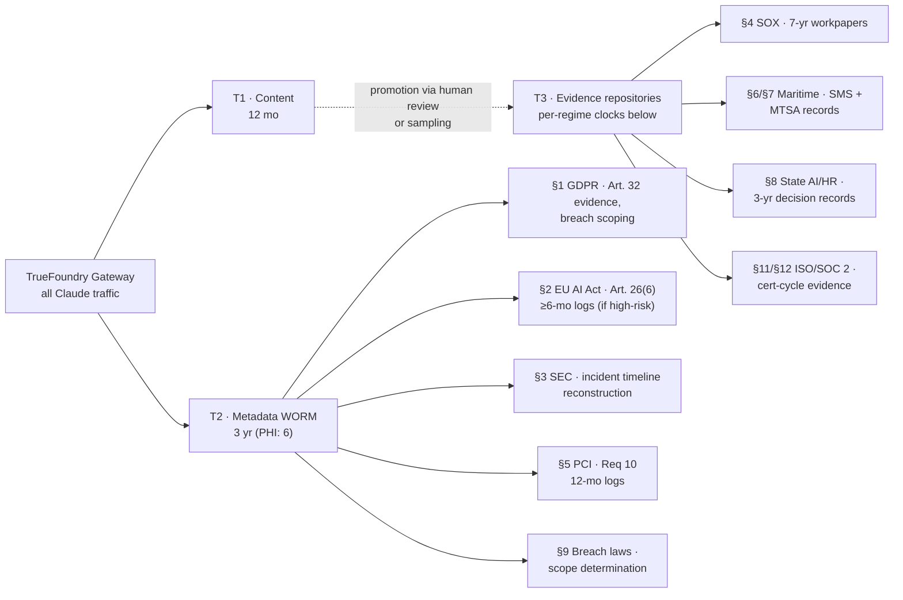

# AI Log Retention & Evidence — All-Regimes Companion

**Scope:** Log, telemetry, and evidence retention duties for AI usage (Claude suite via TrueFoundry gateway) across **every regime in the Company Master Compliance Matrix** (§1–§14 — numbering matches the matrix; never renumbered).
**Companion to:** *AI Interaction Log Retention & Evidence Standard v1* (the SOX-focused standard — referenced below as **the Base Standard**; its tiers T1/T2/T3 are reused here).
**Version:** v1 · **Date:** 2026-08-13 · **Owner:** AI Governance / Compliance
*Not legal advice — validate with counsel; regime applicability follows the Confirmation status column of the Master Matrix.*

---

## 1. The design principle: one pipeline, many clocks

You do **not** build a retention pipeline per regime. You run **one** tiered pipeline (Base Standard v2 §2–§4) and map each regime's clock onto it. Where regimes disagree on how long a class of data must live, **the longest applicable clock for that data class wins — and only for that data class**, never for the whole store.

Recap of the tiers every regime maps onto:

| Tier | Content | Default retention |
|---|---|---|
| **T1** | Full prompt/output content, all users | **12 months** → auto-delete |
| **T2** | Metadata skeleton (who/when/dept/model/connectors/DLP flags), WORM | **3 years** (PHI-flagged: 6) |
| **T3** | Promoted evidence: reviewed deliverables + monitoring memos, in existing document repositories | **7 years** (workpapers) or per-regime below |

The formula stays the same: *a policy that says it, a config that enforces it, a log that proves it.*

Read it this way: **T2 metadata is the workhorse** — most regimes' "prove it later" questions are answered from the 3-year skeleton. **T3 is regime-specific** and lives in the document repositories each function already runs. **T1 exists for incident response and sampling only** — no regime below requires raw chat content to be kept longer than 12 months.

---

## 2. Consolidated retention table (the one page to print)

| § | Regime | What must be retained (AI-relevant) | How long | Tier / where | Trigger |
|---|---|---|---|---|---|
| 1 | **GDPR / UK GDPR** | TFY redaction/block logs, access logs (Art. 32 evidence); DPIA, RoPA, DPA (living docs); breach register (Art. 33(5)); DSAR handling records | Logs: T1/T2 defaults; breach register & DSAR files: **≥3 yrs**, breach register effectively permanent as a register | T2 + Evidence Registry | Always in force |
| 2 | **EU AI Act** | Logs auto-generated by any **high-risk** AI system under Company control | **≥6 months** (Art. 26(6)) — T2 (3 yrs) over-satisfies | T2 | Only if a workflow becomes high-risk (HR/ADMT drift) — assistive-only keeps this dormant; omnibus has shifted high-risk application dates, track them |
| 3 | **SEC cyber disclosure** | Incident timeline evidence, materiality assessment memos, disclosure-controls records | Incident file: **≥6 yrs** (litigation horizon; counsel to set) | T3 (incident files) fed by T2 timeline queries | On incident |
| 4 | **SOX 404 / ICFR** | Reviewed AI-assisted workpapers; monitoring memos; ITGC evidence | **7 yrs** (workpapers); gateway telemetry per T1/T2 | T3 = workpaper repo — **see Base Standard** | Always (finance users) |
| 5 | **PCI DSS v4.0.1** | Audit logs for in-scope systems: **12 months retained, 3 months immediately available** (Req 10.5.1); daily automated log review (10.4.1) | **12 months** — T1/T2 both satisfy; DLP must block PAN from prompts regardless | T1 (available) + T2 | If any AI surface touches CDE-adjacent data — target state: keep AI **out** of CDE scope entirely, document the segmentation |
| 6 | **IMO MSC.428(98) / ISM Code** | AI-related cyber items in the SMS: risk assessments, nonconformities, corrective actions, drill records | Per SMS documentation procedures — through **next audit cycle (typ. 2–3 yrs min)** | T3 = SMS document system | If AI reaches shipboard/OT-adjacent ops — target state: documented N/A + gate (no shipboard AI use) |
| 7 | **USCG cyber rule (33 CFR 101 Subpart F)** | Cybersecurity Plan, cyber incident reports to NRC, drill/exercise and training records | MTSA record conventions (**typ. 2 yrs**) — verify per plan approval | T3 = facility/vessel security records | US-facility/vessel applicability — **VERIFY row**; foreign-flag nuance for counsel |
| 8 | **State AI/HR laws (IL/CO/CA)** | Log of *which HR decisions had AI assistance*; human-review sign-offs; CO decision-review log; notices + delivery proof; ADMT risk assessment | **3 yrs** (CO retention duty; adopt as floor for all states) | T3 = HR compliance files (NOT the chat log — a purpose-built decision log) | The moment AI output assists an IL/CA/CO employment decision |
| 9 | **State breach notification laws** | Breach determination memos (incl. "no notification required" determinations), notification records, scoping evidence | **≥5 yrs** (several states; counsel to set per state mix) | T3 = incident files; scoping answered from T2/T1 | On incident |
| 10 | **NIST AI RMF** | Measurement/monitoring records (sampling memos, red-team results, metric trends) | Per policy — **3 yrs** aligns with T2 | T2 + T3 monitoring memos | Voluntary — evidence doubles for §11 |
| 11 | **ISO/IEC 42001 (AIMS)** | AIMS records: internal audits, management reviews, impact assessments, corrective actions | Full **3-yr certification cycle** | T3 = AIMS document system | If/when certifying |
| 12 | **ISO 27001 / SOC 2** | Logging-control evidence (A.8.15), access reviews, change records covering the gateway | **Audit period (12 mo) + cert cycle (3 yrs)** | T2 + ITGC evidence files | Annual audit |
| 13 | **OWASP Agentic Top 10 / AI Security Standard** | Approval-gate logs, connector/plugin allowlist + vetting records, quarterly grant & scheduled-task reviews, red-team reports | **2–3 yrs** (internal standard; match T2) | T2 + T3 review records | Internal, quarterly |
| 14 | **Vendor due diligence** | Anthropic DPA/BAA, SOC 2 / ISO certs, trust-center snapshots, no-training terms | **Current + prior version**, refreshed annually; contracts: life + 6 yrs | T3 = vendor file | Annual refresh |

**Net effect on the pipeline: nothing in §1–§14 forces T1 content beyond 12 months.** Every longer clock attaches to *derived records* (memos, registers, sign-offs, plans) that live in T3 repositories — exactly the Base Standard's design.

---

## 3. Per-regime detail — what the logs must prove, and to whom

### §1 GDPR / UK GDPR — the regime that limits, not extends, log retention
GDPR is the counterweight in this whole scheme: storage limitation (Art. 5(1)(e)) is why T1 dies at 12 months. What GDPR wants *kept* is not chat content but proof of measures: the TrueFoundry redaction-rule config exports and block/truncation logs are your Art. 32 "appropriate technical measures" evidence — export the config quarterly into the Evidence Registry. The **breach register** (Art. 33(5) — document *every* personal-data breach, notified or not) and **DSAR handling records** are permanent-ish registers, not log-pipeline items. Remember the recursive duty: T1 itself is a personal-data store → it appears in the RoPA, it is in DSAR scope while it exists, and its 12-month deletion *is* your storage-limitation compliance. Deletion evidence (lifecycle reports) is itself Art. 5(2) accountability evidence — file it.

### §2 EU AI Act — the 6-month floor that T2 already clears
Art. 26(6): deployers of **high-risk** AI systems keep the logs the system automatically generates for **at least six months** (longer where other law requires — for you, SOX/PCI do). Today this row is dormant: assistive-only usage with humans deciding keeps the Company out of high-risk classification, and the Digital Omnibus has pushed high-risk application dates. The control here is **drift detection**: the §8 HR-decision log and quarterly sampling are what tell you a workflow is creeping from "drafts" to "decides." If a workflow ever crosses, T2 (3 yrs) already exceeds the 6-month floor — the new work is FRIA/registration, not retention. Track omnibus dates in the matrix's confirmation column.

### §3 SEC cyber disclosure — logs as the materiality stopwatch
The 8-K clock (four business days) starts at the **materiality determination**, and the determination requires knowing scope fast. T2's WORM metadata is what lets you reconstruct "which data, whose, which departments, over what window" in hours. Retain per incident: the timeline reconstruction, the materiality memo (including "not material" conclusions — those get second-guessed), and who-knew-when records. Keep incident files ≥6 years (securities litigation horizon; counsel sets the exact number). WORM matters here specifically: an immutable timeline is what defends the determination date.

### §4 SOX — see the Base Standard
Fully covered by *AI Interaction Log Retention & Evidence Standard v1*: 7-year clock lives in the workpaper repository via the preparer/reviewer control; telemetry stays T1/T2; quarterly sampling memos promote to T3. Nothing added here — that document is the §4 annex.

### §5 PCI DSS v4.0.1 — the one regime with hard log numbers
Req 10.5.1: **12 months of audit logs, most recent 3 months immediately available**; Req 10.4.1: daily automated review of security-relevant logs. Your T1 (12 mo, hot) satisfies both numbers by construction — deliberately so. But the real PCI strategy is **scope avoidance**: DLP blocks PAN patterns at the gateway (this is one place content filtering *does* work — PANs are pattern-matchable, unlike SOX data), no AI connectors into the CDE, and a documented segmentation statement so AI surfaces never become in-scope system components. Evidence: the DLP PAN-block rule export + hit logs, and the segmentation memo for the QSA/SAQ file.

### §6 IMO MSC.428(98) / ISM Code — SMS records, not gateway logs
If AI never touches shipboard or OT-adjacent operations, the deliverable is a **documented N/A + gate**: an SMS cyber-risk entry stating AI tools are shore-side corporate only, plus the technical control (no shipboard network egress to AI endpoints, no OT connectors). That entry, its annual review, and any nonconformities live in the SMS documentation system under its existing retention (through the DOC/SMC audit cycle). Flag/class auditors check the SMS — they will never ask for prompt logs; they will ask whether the risk was assessed and the gate exists.

### §7 USCG cyber rule (33 CFR 101 Subpart F) — VERIFY row
In force July 2025 for US-flagged vessels and MTSA-regulated facilities: Cybersecurity Plan, Cybersecurity Officer, incident reporting to the NRC, drills and training with records. Applicability to foreign-flag cruise vessels vs. the Company's US terminals/facilities is the open scoping question — keep the matrix's VERIFY status and counsel owner. Where it applies, records follow MTSA conventions (typically 2 years); any AI-relevant entries (e.g., AI endpoints in the facility network inventory) sit inside the Cybersecurity Plan documentation, not the log pipeline.

### §8 State AI/HR laws — the log you must BUILD, not just keep
This is the one regime where a *new* log is required rather than retention of an existing one: a purpose-built **AI-assistance decision log** — which employment decision, date, jurisdiction, what the AI contributed (draft/summary — never rank/score/filter), the named human decision-maker, and their recorded rationale. Colorado's review rights drive a **3-year** floor; adopt it for all states. This log lives in HR compliance files (T3), access-restricted — it is *about* employees and sensitive by construction. The gateway's T2 department flags corroborate it (HR-workspace usage volumes should reconcile against logged decisions — a divergence is your drift alarm for §2). Notices + delivery proof retain alongside.

### §9 State breach notification — retention's insurance policy
No pre-set log-retention number, but the entire value of T1/T2 concentrates here on the worst day: without scoping evidence, ~50 state laws force worst-case notification. Retain per event: the scoping analysis (from T1 content if within 12 months — one reason not to go shorter), the determination memo **including negative determinations** ("investigated, no notification required, because…"), and notification records. Several states expect determination documentation kept ~5 years — set the number with counsel across your state mix; apply legal hold the moment an incident is suspected (Base Standard v2 §9).

### §10–§12 NIST AI RMF / ISO 42001 / ISO 27001 & SOC 2 — one evidence base, three consumers
These three consume the *same* records: the quarterly sampling memos, red-team reports, access reviews, gateway change records, and lifecycle-deletion verifications you already produce under the Base Standard. NIST AI RMF (voluntary) wants them as MEASURE/MANAGE evidence; ISO 42001 wants them as AIMS records across the 3-year cert cycle; SOC 2/ISO 27001 auditors want them covering the 12-month audit period (A.8.15 logging, A.8.16 monitoring). Practical rule: **file once in T3, tag for all three**. The only addition is calendar discipline — evidence must exist *continuously across the audit period*, so a skipped quarter is a finding even if nothing bad happened.

### §13 OWASP Agentic / AI Security Standard — logs about the AI's permissions, not its words
The retention objects here are governance records: connector/plugin allowlist with vetting rationale, approval-gate configurations and their change history, quarterly grant + scheduled-task review records, red-team reports. Keep 2–3 years (match T2 so one clock governs). These are what an internal auditor or pentester reads to confirm least-privilege is real and reviewed — content logs are irrelevant to this row.

### §14 Vendor due diligence — the upstream half of your retention story
Your retention scheme assumes Anthropic's side behaves: no-training terms, enterprise retention controls, BAA/DPA commitments. Evidence: executed DPA (+BAA if PHI confirmed), annual trust-center snapshot (SOC 2 report, ISO certs, sub-processor list), and a diff-note when terms change. Keep current + prior versions; contracts follow contract retention (life + ~6 yrs). This file is what you hand any auditor who asks "and what happens to the data on the vendor's side?"

---

## 4. The four clocks, consolidated across all regimes

**Continuous:** gateway capture + DLP tagging (all); PAN blocking (§5); daily automated log review if PCI-triggered (§5); HR decision-logging at point of use (§8).
**Quarterly:** sampling + deletion verification (§4, feeds §10–§12); TFY config export (§1); grant/scheduled-task/allowlist reviews (§13); drift check — HR usage vs. decision log reconciliation (§2/§8).
**Annual:** scoping memo refresh (all); SMS cyber entry review (§6); vendor trust refresh (§14); SOC 2/ISO audit-period evidence assembly (§12); access recertifications.
**Event-driven:** legal hold (§3, §9 — and Base Standard v2 §9); breach register entry + 72-hr GDPR clock (§1); NRC report if §7 applies; 8-K materiality clock (§3); FRIA/registration if a workflow drifts high-risk (§2).

---

## 5. Implementation deltas (what to add on top of the Base Standard)

The Base Standard's four phases stand. This companion adds five concrete items:

1. **DLP rule additions at the gateway:** PAN pattern block (§5, hard block not just tag) and guest-health-data tag (§1/PHI carve-out) — alongside the existing PII/secrets/finance flags.
2. **Build the HR AI-assistance decision log** (§8) — a form/field in the HR workflow, not a log-pipeline artifact; 3-yr retention; reconciled quarterly against T2 HR-workspace metadata.
3. **Registers with their own lives:** breach register (§1/§9) and incident files (§3) get a T3 home with legal-hold integration and counsel-set retention (≥5–6 yrs).
4. **Quarterly TFY config export** into the Evidence Registry (§1 Art. 32 evidence; doubles as §12 change-management evidence).
5. **One tagging taxonomy in T3:** every filed memo/report tagged with the regime §-numbers it serves (e.g., a sampling memo = §4/§10/§11/§12), so audit-evidence assembly is a query, not a hunt.

---

*v1 · 2026-08-13 · § numbering follows the Company Master Compliance Matrix v4 (never renumber; new regimes append). Regime applicability follows the matrix's Scope-confidence and Confirmation-status columns — §7 remains VERIFY. Not legal advice — validate retention numbers with counsel and audit positions with the external audit team.*
