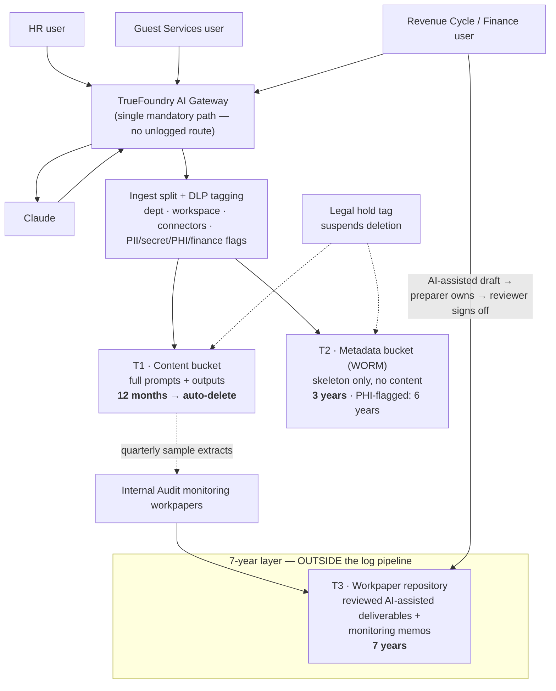
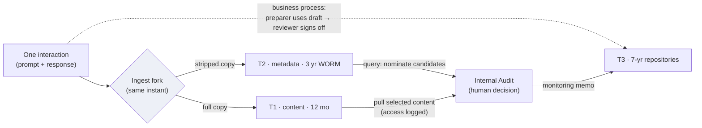
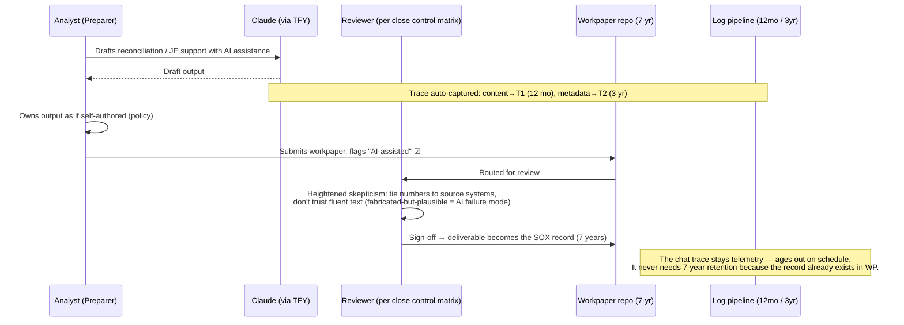

# AI Interaction Log Retention & Evidence Standard

**Scope:** Claude (all surfaces) routed through TrueFoundry AI Gateway — HR, Guest Services, Financial Services / Revenue Cycle
**Compliance scopes:** SOX (ICFR), PII (GDPR / CCPA / state privacy), potential PHI (guest health-adjacent data)
**Version:** v2 (adds §4 — tier relationships & movement mechanics) · **Date:** 2026-08-13 · **Owner:** AI Governance / Compliance
*Not legal advice — validate with counsel and confirm SOX record-classification positions with the external audit team.*

---

## 1. The Principle (one sentence)

> **Keep everything briefly, keep the skeleton for 3 years, and let the 7-year record be the reviewed deliverable — not the chat.**

Unpacked:

| Phrase | What it means | Why |
|---|---|---|
| **Keep everything briefly** | Every prompt and output, from every user, is captured at the gateway — full content — but retained only **12 months**, then auto-deleted. | Completeness is what makes every later assertion possible ("there is no unlogged path"). Short retention is what keeps 12 months of HR conversations and guest PII from becoming a permanent regulated data store. |
| **Keep the skeleton for 3 years** | The **metadata** of every trace (who, when, which department/workspace, which model, which connectors touched, DLP classification flags — *no content*) is retained **3 years**, immutable (S3 Object Lock / WORM). | Metadata answers the questions auditors and regulators actually ask years later — "did revenue-cycle staff use AI during the FY close?", "did PHI-flagged traffic occur in Q2?" — without carrying content-level privacy liability. |
| **The 7-year record is the reviewed deliverable** | Nothing in the log pipeline is kept 7 years. The SOX record is the **finished, human-reviewed workpaper** (reconciliation, JE support, flux commentary) that lands in the existing workpaper repository — which already has 7-year retention. | SOX §802 retention attaches to **records that support the audit and financial reporting**, not to tools or keystrokes. The chat trace is upstream telemetry; the workpaper is the record. |

**Memorable formula:** *a policy that says it, a config that enforces it, a log that proves it.*

---

## 2. Retention Schedule (the policy table)

| Tier | What | Retention | Storage | Controls | Owner |
|---|---|---|---|---|---|
| **T1 — Full content** | Complete prompts + outputs, all users, all departments | **12 months**, then automated deletion | Content S3 bucket ("hot") | Encrypted; access restricted to named IR/compliance group; every access logged | Security / IR |
| **T2 — Metadata skeleton** | User, timestamp, dept/workspace, model, connectors invoked, token counts, DLP flags (PII / secret / PHI / finance-connector). **No content.** | **3 years** | Compliance S3 bucket, **Object Lock (WORM)** | Immutable; lifecycle-managed; queryable (Athena) | Compliance |
| **T3 — Promoted evidence** | (a) Reviewed AI-assisted deliverables in the close package; (b) quarterly monitoring sample extracts + memos | **7 years** | Existing workpaper repository (FloQast / Blackline / SharePoint) — *not* the log pipeline | Standard workpaper controls (prepared-by / reviewed-by, sign-off) | Controller / Internal Audit |
| **Override — PHI carve-out** | Metadata of traces DLP-flagged as containing guest health data | **6 years** (metadata tier extended) | Compliance bucket, separate lifecycle tag | Counsel to confirm HIPAA vs. state health-data law applicability | Privacy / Legal |
| **Override — Legal hold** | Any trace (content or metadata) for identified users / date ranges | **Deletion suspended** until hold released | In place (lifecycle rule exempted by hold tag) | Hold triggered the moment litigation/investigation is reasonably anticipated | Legal |

**Rules that make the table real:**

- Whatever number is written here is **followed exactly**. A policy that says 12 months while 3 years sit in the bucket is a worse audit position than no policy.
- Deletion must **actually execute** — lifecycle-rule execution is verified as part of the quarterly monitoring check (evidence: lifecycle report / object-count trend).
- The 12-month T1 window is the floor for the detective control: sample before the evidence ages out.
- Why 12 months (not 1–3 years of content): breach investigations routinely look back ~a year; PCI expects 12 months of logs; anything longer multiplies DSAR/deletion-request surface, discovery exposure, and breach blast radius for **zero** additional SOX benefit.

---

## 3. Architecture — where every trace goes



Key reading of the diagram: **content flows down and dies young; metadata flows down and lives 3 years immutable; only human-reviewed artifacts cross into the 7-year layer, and they get there through the close process, not through log promotion.**

---

## 4. How the tiers relate — and how content moves (or doesn't) between them

The tier labels hide a simple idea: **all three tiers start from the same event, but keep different amounts of it, for different lengths of time, to answer different questions.** This section makes the mechanics explicit, because two common misreadings — "T2 is extracted from T1 later" and "traces get automatically promoted to T3" — both lead to broken designs.

### 4.1 One trace, three fates — a walk-through

An analyst asks Claude to draft a revenue reconciliation on March 5:

- **T1** holds the full conversation — every word — until March 5 of the following year, then automated deletion. While it lives, only the named IR/compliance group can read it, and every access is logged.
- **T2** holds the skeleton for 3 years, immutable: *user, Finance workspace, 2027-03-05 14:12, Claude, NetSuite connector touched, finance-flag = yes.* No words.
- **T3** holds the **outcome**: the finished reconciliation the analyst submitted with the "AI-assisted" flag, reviewed and signed off by her manager, sitting in the workpaper repository for 7 years. Note: T3 does **not** contain the chat — it contains the deliverable the chat helped produce, plus the human sign-off.

### 4.2 Similarities and differences at a glance

| | T1 | T2 | T3 |
|---|---|---|---|
| Contains | the words | facts *about* the interaction | reviewed human work product |
| Gets there | automatically, everything | automatically, everything | **manually — human-gated** |
| Lives | 12 months | 3 years, WORM | 7 years, in existing repos |
| Answers | "what exactly was said?" (incidents, sampling) | "did it happen — who, when, touching what?" (auditors, regulators, scoping) | "was it controlled?" (SOX record, control evidence) |
| Risk profile | high — it *is* PII/PHI, must die young | low — no content, can live long | already governed by workpaper controls |

Design rule in one line: **the more sensitive the copy, the shorter it lives; the longer something must live, the less raw content it may contain.** The tiers are not three stores to reconcile — they are one event decaying gracefully: full detail while an incident might need it, skeleton while an auditor might ask, permanent record only for the part a human stood behind.

### 4.3 T1 → T2: there is no movement

T2 is **not** derived from T1 on any schedule. Both copies are written **simultaneously, at ingest**, when the trace hits the gateway: the pipeline forks — full copy → T1, stripped copy → T2 — in the same processing step. This is deliberate: if T2 were extracted from T1 later, T2's completeness would depend on T1 still existing, and a deleted, held, or corrupted T1 object would leave holes in the 3-year skeleton. Because the copies are independent from birth, T1 dies on its 12-month schedule and T2 remains complete. Nothing ever "graduates" from T1 to T2.

### 4.4 T1 → T3: two paths, both through human hands

**Path 1 — the workpaper (the normal case; not a log-pipeline movement at all).** When an AI-drafted reconciliation ends up in the workpaper repository, no one copies a trace out of the T1 bucket. The content travels through the **business process**: the preparer takes the draft from the Claude session, works it into the workpaper, flags it AI-assisted; the reviewer signs off; the deliverable enters the repository. The T1 trace is never touched — it ages out on schedule. The log and the workpaper are two independent records of the same event that never physically connect. The human review control is what carries the content into the 7-year layer.

**Path 2 — the sampling pull (the only genuine extraction from T1).** Quarterly, Internal Audit queries T2 metadata to select candidates, pulls those specific traces' content from T1 (access logged), and files the extracts inside a monitoring memo — which becomes a workpaper with 7-year retention. Human-initiated, human-selected, documented.

### 4.5 Why T3 promotion is manual by design — not a tooling gap

Automated promotion to 7-year retention fails on both sides:

- **It cannot work for SOX.** SOX-relevant content has no detectable pattern — an accrual is just numbers and prose — so any auto-promoter would miss real records and sweep in noise (see §5: content filtering does not work for SOX).
- **Where it could work, it is harmful.** Auto-promoting anything DLP-flagged would sweep HR conversations and guest PII into a 7-year store — recreating exactly the privacy liability the tiering exists to eliminate.

The one sensible automation is **nomination, not promotion**: DLP tags may auto-populate the quarterly sampling candidate list (e.g., "finance-connector touched during close week"). **Machines nominate; humans promote.** The human decision "this is evidence" is itself the control — it is what makes the extract defensible and what the auditor tests.



---

## 5. The close-process control — how a trace becomes (or doesn't become) a SOX record



**Who reviews:** nobody new — the existing preparer/reviewer hierarchy. The preparer owns AI output as if they wrote it (state this verbatim in policy). The reviewer is whoever already reviews that item per the close control matrix. The only addition is the **"AI-assisted" flag** on the workpaper — which also gives you a free, queryable population when auditors ask "show us how you control this."

---

## 6. The detective control — quarterly monitoring (why T1 exists)

```mermaid
sequenceDiagram
    participant IA as Internal Audit / Compliance analyst
    participant T2 as Metadata bucket (3 yr)
    participant T1 as Content bucket (12 mo)
    participant WP as IA workpapers (7 yr)

    IA->>T2: Query: finance-dept users, close-period dates,<br/>finance-connector or volume anomalies
    T2-->>IA: Candidate trace list (metadata only)
    IA->>T1: Pull sampled trace content (access logged)
    T1-->>IA: Sample extracts
    IA->>IA: Check for unsanctioned use in reporting processes;<br/>verify lifecycle deletions executed
    IA->>WP: Monitoring memo + extracts filed as workpapers (7 yr)
    IA->>IA: Findings → follow-up / policy update / scoping memo refresh
```

This doesn't need to be heroic. A **documented sampling procedure, executed on schedule, with findings recorded** is a real control an auditor can test. The gateway's completeness assertion ("no unlogged path") is what makes the sample meaningful.

---

## 7. Implementation sequence

**Phase 1 — Paper (week 1–2).** Write the retention policy using the table in §2, verbatim numbers. Write the scoping/risk-assessment memo ("AI use in revenue cycle: sanctioned uses, constraints, rationale for exclusions") — prefer **documented N/A + gate** over control theater. Add the preparer-ownership clause and AI-disclosure requirement to the AI usage policy. Get legal sign-off on retention numbers and the PHI carve-out question (HIPAA vs. state health-data law); get external audit's ack of the record-classification position (chat = telemetry, workpaper = record) **before** fieldwork, not during.

**Phase 2 — Pipes (week 2–4).** Configure TrueFoundry as the single mandatory path (block direct API/app routes at network/SSO level). Implement ingest split: metadata extraction + DLP tagging (PII, secrets, PHI patterns, finance-connector-touched flag, department/workspace). Stand up the two buckets: content bucket with 12-month lifecycle deletion; metadata bucket with Object Lock and 3-year lifecycle (6-year tag branch for PHI-flagged). Restrict content-bucket access to the named IR group; log the access.

**Phase 3 — People (week 3–5).** Add the "AI-assisted" flag to the workpaper template/system. Brief preparers (you own it) and reviewers (tie to source, don't trust fluency). Enforce connector restrictions: no ERP/GL connectors for unauthorized roles — prevention by architecture beats detection by vigilance.

**Phase 4 — Proof (quarterly, ongoing).** Run the §6 sampling procedure. Verify lifecycle deletions executed. Refresh the scoping memo annually or on change (new use case, new connector, reorg). Test gateway ITGCs: admin access reviews, change management over routing/logging config, log-pipeline integrity (Object Lock covers tamper-evidence).

**The four clocks:** continuous (gateway capture + DLP tagging) · quarterly (sampling, deletion verification) · annual (scoping memo, policy review, access recertification) · event-driven (legal hold, incident, new use case).

---

## 8. Owners at a glance

| Item | Owner | Frequency |
|---|---|---|
| Gateway config, mandatory-path enforcement, ITGCs | IT / Security | Continuous + annual access review |
| Retention policy + legal-hold procedure | Legal / Compliance | Annual review; hold = event-driven |
| DLP tagging rules, bucket lifecycle rules | Security / Compliance eng. | Continuous; rules reviewed quarterly |
| Preparer/reviewer control, AI-assisted flag | Controller | Every close |
| Sampling procedure + monitoring memos | Internal Audit | Quarterly |
| Scoping / risk-assessment memo | AI Governance | Annual + on change |
| PHI applicability determination | Privacy counsel | Once, then on change |

---

## 9. Legal hold procedure (the override that protects the whole scheme)

1. **Trigger:** litigation, regulatory inquiry, or internal investigation is *reasonably anticipated* — not merely filed. Legal makes the call.
2. **Action within 24h:** apply hold tags to affected users/date ranges in both buckets; lifecycle rules exempt held objects automatically.
3. **Scope memo:** Legal documents who/what/date-range and why.
4. **Verification:** Compliance confirms held objects excluded from the next deletion cycle (evidence retained).
5. **Release:** only Legal releases; normal lifecycle resumes; release memo filed.

Deleting on schedule during a hold is how a clean retention policy becomes a spoliation problem. The hold mechanism is what lets you delete confidently everywhere else.

---

*v2 · 2026-08-13 · Not legal advice — validate retention numbers with counsel and record-classification positions with the external audit team.*
